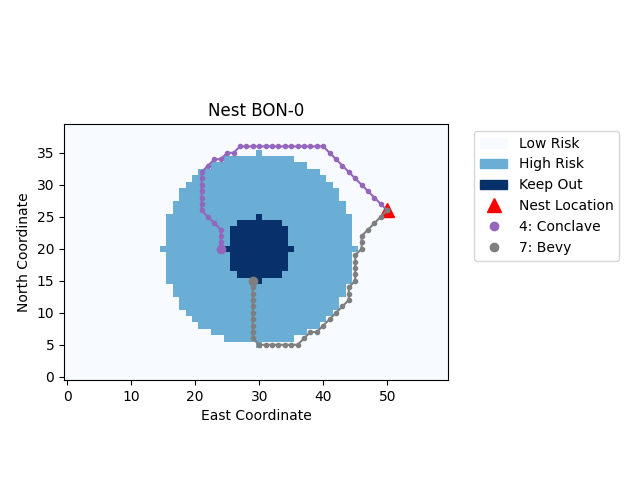

# RiP-Planner
RiP: Reachability based (Ri)sk Aware (P)lanner

RiP is a path planning algorithm which leverages the technique of reachability based trajectory design to generate a minimum risk path for a vehicle in the presence of obstacles. The risk is minimized by assigining risk boundaries around the obstacles and then optimizing the path for length as well as risk. This algorithm is most suited for cases where the obstacles are adverserial and missions where safety is of utmost priority.

A sample output of our algorithm is as shown in the figure below. As can be clearly observed, the final trajectory generated avoids the low risk zone for as long as possible and entirely avoids the high risk zone.

